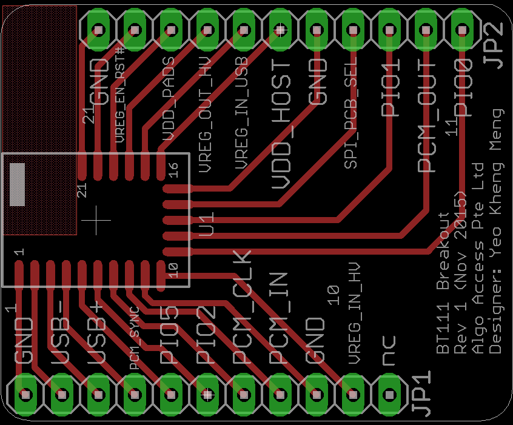
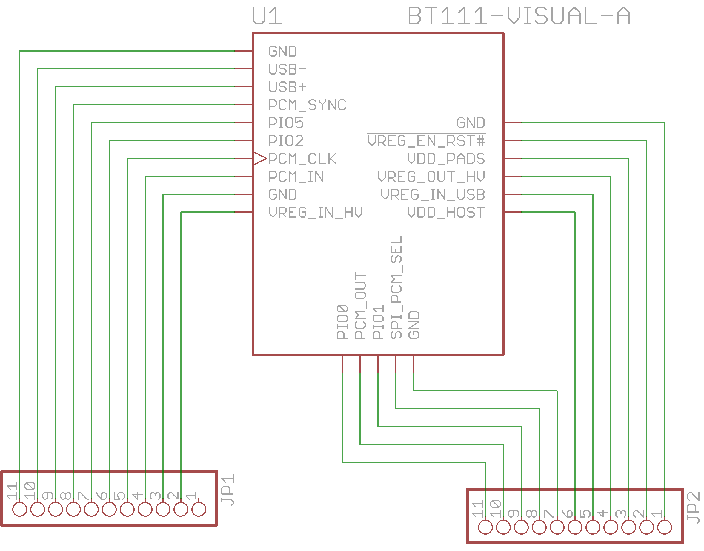

# pcb-breakout-bt111
Pin breakout of the Bluegiga BT111 board to through-hole pin headers for prototyping. 

##PCB Design software and addons used

1. Eagle 7.5.0: I use Standard but Light should still be able to open/modify the files.
2. BT111 library by [jshrowberg](https://github.com/jrowberg/sf-oshw/tree/master/bluegiga/eagle) (in repo as sf-bluegiga.lbr)

##Images
None at this time

##Schematic drawings
Images are exported from Eagle at 600dpi.

##Parts required

The BT111 module can be bought from one of the online stores like [Mouser](http://www.mouser.sg/ProductDetail/Bluegiga-Technologies/BT111-A-HCI/?qs=%2fha2pyFaduivsoc9o%252b2ay07XF51Ha8cewDylb7jSEvcMIawLVwDmnw%3d%3d)
